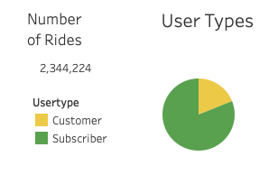
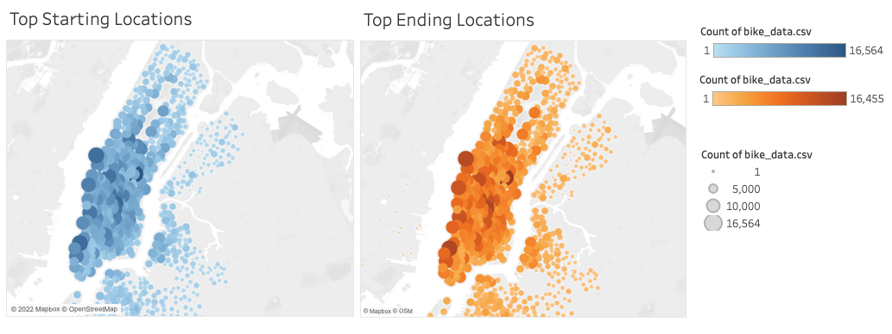
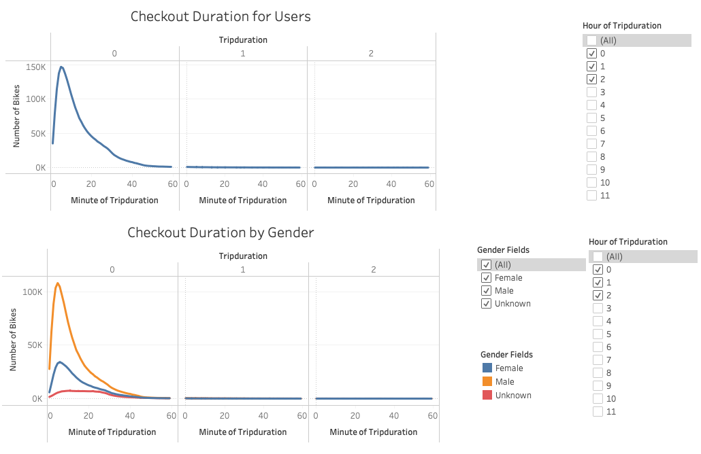
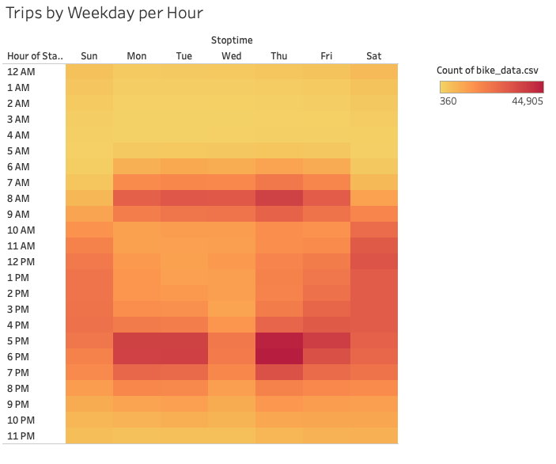
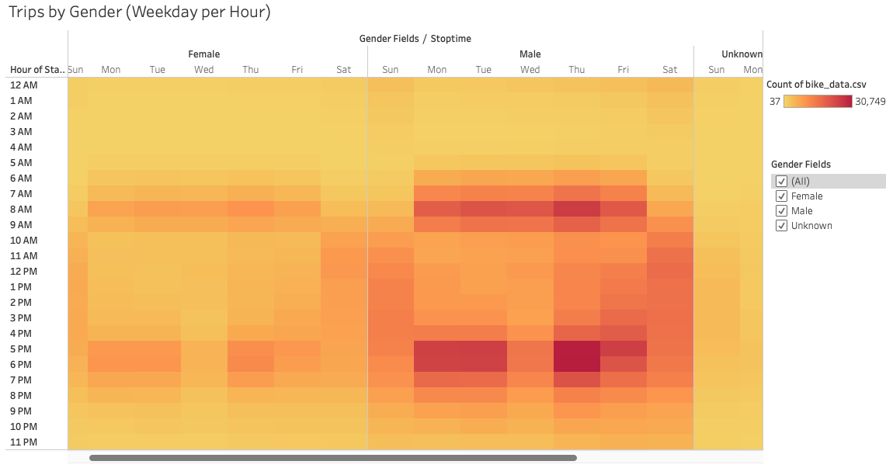
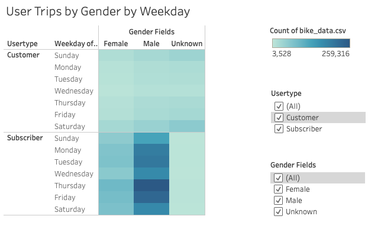

# NYC Citi Bike Analysis
Using Tableau to present a bikesharing analysis

## Overview
The purpose of this project was to investigate data to inform a potential business venture aimed to start a bike sharing company in Des Moines, Iowa. To gather some preliminary information, Citi Bike data from August of 2019 in New York City was analyzed to better understand usage patterns. First, the investigation looked at total usage, starting and stopping locations, and trip durations. Then, the analysis continued by looking more closely at trends across the days of the weeks as well as differences among gender types and user types. 
 

## Resources

  * Tableau
  * Python
  * Pandas

# Results
Some insights from the Citi Bike analysis are displayed in the following visualizations. They provide a more detailed view of bike usage and user demographic trends in NYC.

### Total Riders, One Time Customers, and Subscription Customers
From the data, 2,344,224 rides were observed in August of 2019 in NYC. Citi Bike users can pay via a subscription or as a one time customer. Of the rides observed a large majority (1,900,359) were from subscribers. The marker plots show the starting and stopping locations of bikes. Marker sizes scale with the number of bikes per location. It appears that for both Starting and Stopping, bike activities seemed greater closer to the city center and eased gradually moving away from the center with little to no activity west of the city's western river boundary. 

### Trip Starting and Stopping Locations
The marker plots show the starting and stopping locations of bikes. Marker sizes scale with the number of bikes per location. It appears that for both Starting and Stopping, bike activities seemed greater closer to the city center and eased gradually moving away from the center with little to no activity west of the city's western river boundary. 

### Bike Checkout Time Duration
The time bikes were checked out per ride was also of interest in this investigation. Overall, it appeared that the vast majority of trips were far under one hour.  The most common trip duration was around five minutes with a steep decline in trips as the duration increased from there. Furthermore, the same trend was also observed after segmenting by gender. Although it appears that many more riders were male than female. 

### Number of Trips by Hour of each Weekday
In this visualization, the more popular times throughout the day for bike trips are seen across the week. It appears that for weekdays, 7am - 10am and 5pm - 8pm are more popular.  For the weekends it appears that 10am to 5pm are more popular with Saturday being slightly more popular that Sunday. 

### Number of Trips by Hour of each Weekday for Gender Types
Breaking this same analysis down by gender provides additional insights. It appears that the weekday and weekend pattern described previously was present for both male and females although male riders accounted for more trips. 

### Number of Trips by Hour of each Weekday for Gender Types and User Type
This same analysis was further segmented by user type to provide more narrow insights. It appears that for both male and female riders, subscribers accounted for more trips than one time customers. 

# Summary
Overall, several trends can be gleaned from the New York Citi Bike data analysis.  First, it appears that most rides are occurring for relatively short trips closer to the center of city activity. Second, it appears that during the week, more trips happen in the morning and evening during typical commute times while weekend traffic is more popular mid day.  Third, male riders seemed to engage in more riders than female or undeclared riders. Fourth, for both male and female riders subscribers took more rides than one time customers. 

To gain greater insight, additional studies may be conducted. One such study may be into the potential loss of bikes. It appeared that there were approximately 100 fewer bike ending locations than there were starting locations. Another study could look at the station locations broken down by gender and user type. Furthermore, it may be beneficial to investigate the traffic to businesses near these trends to see if there are partnering opportunities to promote the use of Citi Bikes to get raiders to these locations. 

[Link to Tableau Visualizatioin Dashboard](https://public.tableau.com/views/citibikes_trips_analysis/NYCCitiBikeTrends?:language=en-US&publish=yes&:display_count=n&:origin=viz_share_link "Tableau Visualizations")
